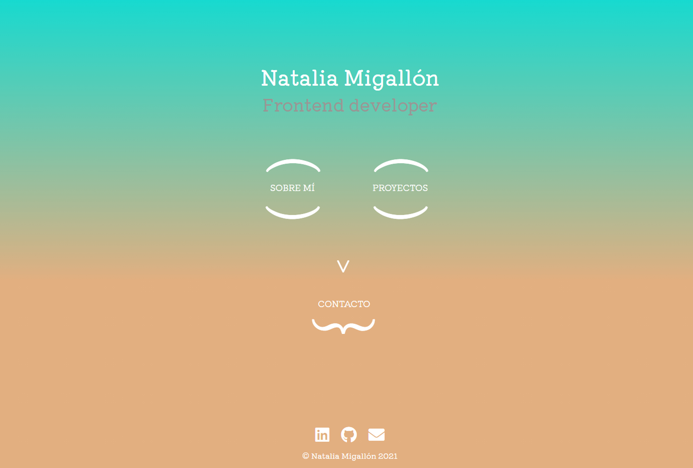

## Portfolio Natalia Migallón

¡Hola! Soy Natalia y este es el repositorio de mi `portfolio`. En él puedes recorrer las distintas secciones para conocerme un poco mejor y ver los proyectos que he llevado a cabo.

Como esqueleto del site, he utilizado el `starter kit` de [Adalab](https://adalab.es/), que incluye un `motor de plantillas HTML`, el `preprocesador SASS` y un servidor local. Además he añadido, para manejar ciertas funcionalidades de la web, una carpeta donde se almacenan los diferentes archivos de `Javascript`.

Cualquier sugerencia o propuesta es bienvenida, por lo que puedes ponerte en contacto conmigo a través de Linkedin , mi correo  o el [formulario de mi página](https://nataliamigallon.github.io/portfolio-natalia-migallon/contact.html).
